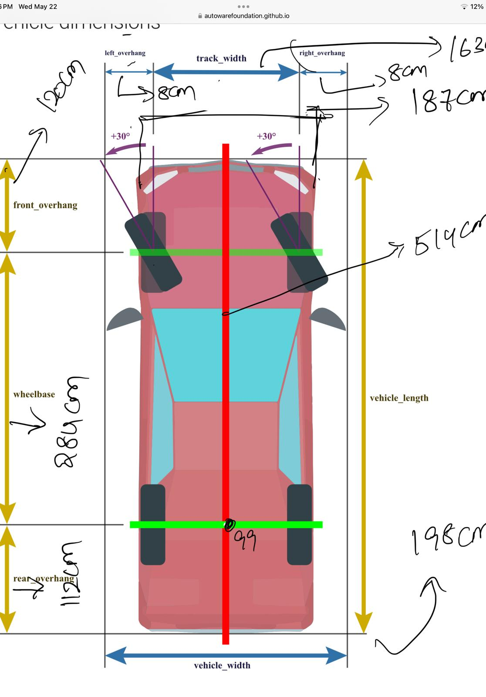
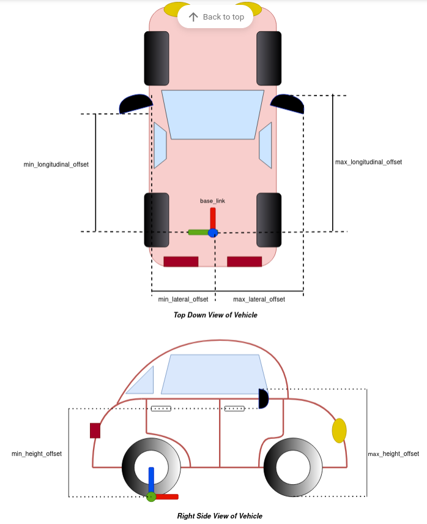

# mkz vehicle properties




```cmd
front_overhang : 120 cm
rear_overhang : 112 cm
left_overhang and right_overhang : 8 cm
wheel_base : 284 cm
vehicle_length : 514 cm
vehicle_width : 198 cm
track_width : 163 cm

```



* need to calculate the values
